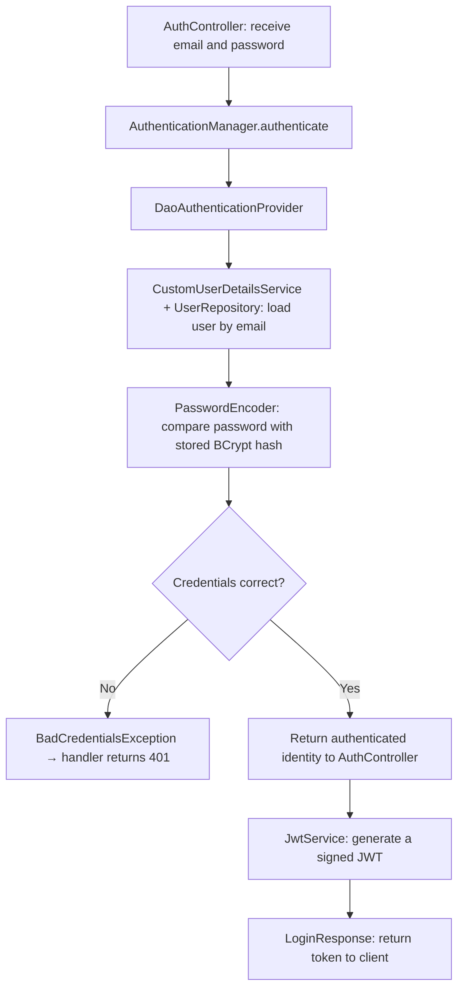
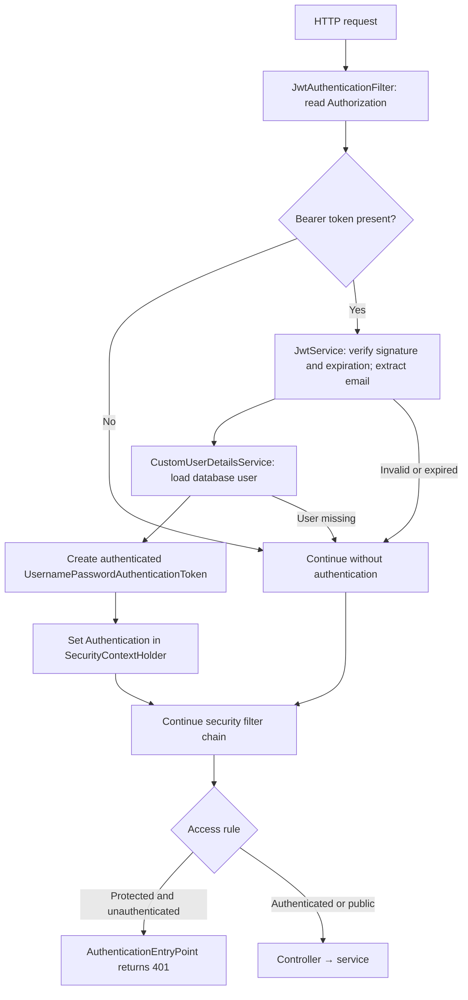
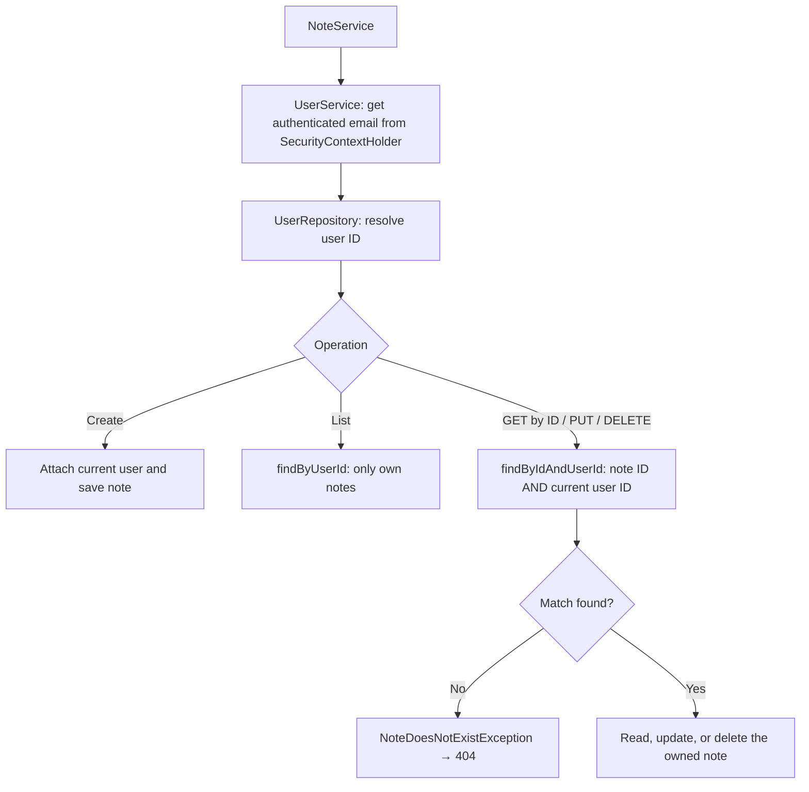
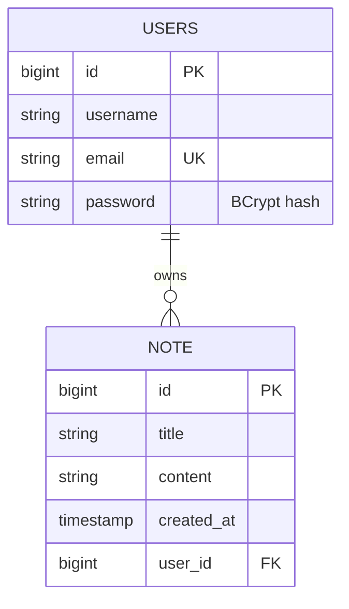

# Secure Notes API

A Spring Boot REST API where users register, authenticate with JWT, and manage their own private notes. Built as part of a one-project-per-day backend learning challenge, with a focus on understanding authentication and ownership.

## Features

- Registration with unique emails and BCrypt password hashing.
- Login with signed JWTs that expire after one hour.
- Stateless Bearer-token authentication.
- Create, list, read, update, and delete notes belonging to the authenticated user.
- Validated request DTOs and response DTOs that exclude passwords.
- PostgreSQL persistence and Swagger UI documentation.

## Technology

Java 17 · Spring Boot 4.1.1 · Spring Web MVC · Spring Data JPA / Hibernate · Spring Security · Jakarta Validation · PostgreSQL 17 · JJWT 0.12.6 · Springdoc OpenAPI 3.1.1.

Maven Wrapper is included. Docker Compose provides the local database.

## Run locally

Requires Java 17 or later and Docker Compose, or an existing PostgreSQL database.

1. Copy the configuration template:

   ```powershell
   Copy-Item .env.example .env
   ```

2. Set your values in `.env`:

   ```properties
   POSTGRES_DB=notesapi
   POSTGRES_USERNAME=notesapi
   POSTGRES_PASSWORD=your-local-database-password
   JWT_SECRET=your-random-signing-secret
   ```

   Replace the JWT placeholder with a randomly generated secret of at least 32 bytes. The implementation uses its UTF-8 bytes directly; it does not Base64-decode the value. Keep the secret stable across restarts if existing tokens should remain valid. The local `.env` is excluded from Git.

3. Start PostgreSQL:

   ```sh
   docker compose up -d
   ```

   The database is exposed at `localhost:5433` and persists in a named volume. Changing `.env` does not update credentials in an already initialized database volume.

4. From the project root, start the application:

   ```powershell
   .\mvnw.cmd spring-boot:run
   ```

   On Linux/macOS, use `./mvnw spring-boot:run`. Spring imports the root `.env` as a properties file. Hibernate updates the schema with `ddl-auto=update`.

- API: [http://localhost:8080](http://localhost:8080)
- Swagger UI: [http://localhost:8080/swagger-ui/index.html](http://localhost:8080/swagger-ui/index.html)
- OpenAPI JSON: [http://localhost:8080/v3/api-docs](http://localhost:8080/v3/api-docs)

## Endpoints

| Method | Path | Purpose | Success | Authentication |
| --- | --- | --- | --- | --- |
| POST | `/api/auth/register` | Register a user | 200 | Public |
| POST | `/api/auth/login` | Authenticate and receive a JWT | 200 | Public |
| POST | `/api/notes` | Create a note | 200 | Bearer JWT |
| GET | `/api/notes` | List own notes | 200 | Bearer JWT |
| GET | `/api/notes/{id}` | Read an owned note | 200 | Bearer JWT |
| PUT | `/api/notes/{id}` | Update an owned note | 200 | Bearer JWT |
| DELETE | `/api/notes/{id}` | Delete an owned note | 204 | Bearer JWT |

### Registration

Send `POST /api/auth/register` with `Content-Type: application/json`:

```json
{
  "username": "reda",
  "email": "reda@example.com",
  "password": "password123"
}
```

Username and email must be nonblank; email must be valid. Passwords must have at least eight characters. `AuthService` checks the email, hashes the password using BCrypt, and saves the user. The response excludes the password:

```json
{
  "id": 1,
  "username": "reda",
  "email": "reda@example.com"
}
```

### Login

Send `POST /api/auth/login`:

```json
{
  "email": "reda@example.com",
  "password": "password123"
}
```

Response:

```json
{"token": "<signed-jwt>"}
```

### Notes

Creating and updating a note use the following body:

```json
{
  "title": "Learn Spring Security",
  "content": "Understand JWT filters and the security context."
}
```

Both fields must be nonblank. Content has a maximum of 5,000 characters. Every notes request requires:

```http
Authorization: Bearer <signed-jwt>
```

Example response:

```json
{
  "id": 1,
  "title": "Learn Spring Security",
  "content": "Understand JWT filters and the security context.",
  "createdAt": "2026-10-09T12:00:00.000+00:00",
  "userId": 1
}
```

The client does not supply `userId` or `createdAt`: the server assigns them during creation. Updates change only title and content. Listing returns an array of note responses, or `[]` when the user has no notes. DELETE returns no body.

## Security workflow

### 1. Login: credentials become a signed token



This diagram follows the actual implementation: `AuthController` calls `AuthenticationManager` directly, then calls `JwtService`. `AuthService` handles registration, and the token response is named `LoginResponse`.

The provider asks `CustomUserDetailsService` for the database user and password hash. It uses BCrypt to verify the submitted password. Your user details service loads the user; it does not perform the password comparison itself.

Spring throws `BadCredentialsException` for a wrong password. By default, it also converts an unknown user into the same exception. `GlobalExceptionHandler` returns 401 with "Invalid email or password" for both cases.

After successful authentication, `JwtService` creates a token containing:

| Claim | Meaning |
| --- | --- |
| `sub` | The authenticated user's email |
| `iat` | Issue time |
| `exp` | Expiration time, one hour after issue |

The JWT is signed, not encrypted. Its contents can be read, but changing them invalidates the signature. Passwords are never included in it. Anyone holding a valid token can act as that user, so keep tokens private.

### 2. Protected request: the token becomes request authentication



The filter runs before `UsernamePasswordAuthenticationFilter` in the security chain. It is constructed in `SecurityConfig`, avoiding a separate servlet-filter registration.

The request flow is:

1. Read the `Authorization` header and extract the Bearer token.
2. Verify the signature and expiration before trusting the email inside it.
3. Load the user through `CustomUserDetailsService` and check token validity.
4. Create an authenticated object containing the user and their authorities. No password is needed: the verified token is the credential for this request.
5. Place that object in `SecurityContextHolder`, which holds the identity during request processing.
6. Continue the chain so authorization can decide access before the controller runs.

For expected token or user-lookup failures, the filter clears authentication and continues. It does not write the error response itself. A later authorization check rejects an unauthenticated request to a protected endpoint, and `AuthenticationEntryPoint` returns 401. Public endpoints remain accessible even when a supplied token is invalid.

### 3. Ownership: the authenticated user can access only their notes



Authentication proves who is calling. Ownership checks decide whether that person can access a particular note.

The shared `findNoteById()` helper uses:

```java
noteRepository.findByIdAndUserId(
        id,
        userService.getCurrentUser().getId()
);
```

The owner ID comes from the authenticated identity, never from the request body. A missing note and another user's note both return 404. If the lookup fails, update/delete never runs.

### Security rules

| Configuration | Behavior |
| --- | --- |
| POST `/api/auth/*` | Public registration and login |
| `/swagger-ui/**`, `/swagger-ui.html`, `/v3/api-docs/**` | Public documentation |
| All other requests | Authentication required |
| `SessionCreationPolicy.STATELESS` | No login session between requests |
| CSRF disabled | This flow explicitly sends Bearer credentials in a header, rather than using authentication cookies |

Stateless does not mean "no database queries." Each request verifies its JWT and loads the user. The client must send the token again on the next request.

## Data model



One user can have many notes; every note has one owner. `Note.user` is the owning `@ManyToOne` side and stores the `user_id` foreign key. `User.notes` uses `@OneToMany(mappedBy = "user")`: `mappedBy` refers to the Java field, not the SQL column.

`CascadeType.REMOVE` removes associated notes when a user is deleted through JPA. This API does not expose a user-deletion endpoint.

### Persistence concepts learned

- **New objects need persistence:** registration and note creation call `save()`. `@Transactional` alone does not persist a newly constructed object.
- **Dirty checking updates managed entities:** `updateNote()` loads the owned note inside a transaction and changes its title/content. Hibernate flushes those changes when the transaction commits; no explicit `save()` is needed.
- **Repeated lookup is not necessarily N+1:** a single-note request can query the user in the JWT filter, query them again in `UserService`, then query the note. This is a fixed repeated lookup. N+1 means additional queries per item as a fetched collection grows.

## Class responsibilities

| Component | Responsibility |
| --- | --- |
| `AuthController` | Registration/login endpoints; authenticate credentials and return JWT |
| `AuthService` | Email uniqueness check, BCrypt hashing, and user persistence |
| `CustomUserDetailsService` | Convert the database user into Spring Security `UserDetails` |
| `JwtService` | Generate signed tokens, verify them, and extract claims |
| `JwtAuthenticationFilter` | Establish request authentication from a Bearer token |
| `SecurityConfig` | Access rules, filter placement, encoder, and authentication manager |
| `UserService` | Resolve the authenticated database user |
| `NoteController` / `NoteService` | Notes endpoints, ownership, persistence, and DTO mapping |
| Repositories | Database queries, including owner-scoped queries |
| `GlobalExceptionHandler` | Duplicate-email, invalid-login, and note-not-found responses |

## Error handling

| Situation | Status |
| --- | --- |
| Duplicate email | 409 |
| Wrong login credentials | 401 |
| Protected request without valid authentication | 401 |
| Note missing or owned by another user | 404 |

Example application error:

```json
{
  "status": 404,
  "message": "Note with id: 5 does not exist",
  "timestamp": "2026-10-09T12:00:00"
}
```

The security entry point returns:

```json
{"status": 401, "message": "Authentication required"}
```

Validation is activated by `@Valid`. Validation exceptions do not currently have a custom handler; they use Spring MVC's default handling. Security rules can also affect a subsequent error dispatch, so verify the final HTTP response for invalid bodies during testing.

## Verify with two users in Postman

1. Register User A and User B with different emails; log in as each and keep their tokens separately.
2. Create a note using User A's token and record its ID.
3. List notes as each user: only User A should see that note.
4. As User B, try GET, PUT, and DELETE on User A's note ID. Each should return 404.
5. Fetch the note as User A to confirm the rejected update/delete did not change it.
6. Update it as User A, then fetch it again to confirm persistence. Owner and creation time should remain unchanged.
7. Delete it as User A: expect 204. Fetch again: expect 404.
8. Request notes without a token, with a modified token, and with an expired token: expect 401.
9. Test incorrect login credentials, duplicate email, blank fields, and content longer than 5,000 characters.

In Postman, choose **Authorization → Bearer Token** and paste only the token; Postman adds the prefix. Registration and login use POST. Sending a JSON body does not change the HTTP method.

Compile on Windows:

```powershell
.\mvnw.cmd -DskipTests compile
```

The included context-load test requires the configured database and environment values. Compilation checks Java code, not HTTP security behavior; the two-user API checks verify ownership end to end.

## Learning scope

This project covers CRUD, BCrypt, JWT authentication, JPA relationships, and ownership authorization. Refresh tokens, OAuth login, account recovery, and administration are outside the challenge's scope.
